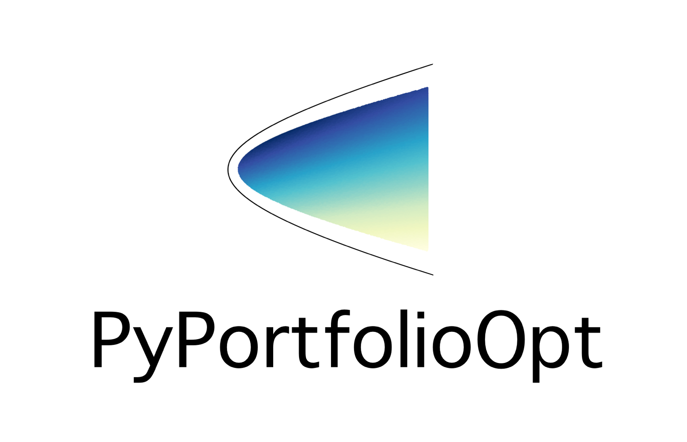

# Unsupervised-Learning-Algorithmic-Trading-Strategy

 

 

## Overview

- This repository is the result of following [this tutorial](https://www.youtube.com/watch?v=9Y3yaoi9rUQ) from Freecodecamp regarding how machine learning can be applied to algorithmic trading
- The purpose of following this tutorial was to expand my machine learning skills into an area of which I have nascent knowledge but an interest in, which is algorithmic trading
- The content of this repository consists of the development of an algorithmic investment strategy which includes several factors which will be discussed below, including [Garman-Klass Volatility](https://breakingdownfinance.com/finance-topics/risk-management/garman-klass-volatility/), [MACD](https://www.investopedia.com/terms/m/macd.asp), and the [Fama-French Factors](https://www.quantconnect.com/research/15262/fama-french-five-factors/p1), and applying those insights through a [K-Nearest Neighbours](https://towardsdatascience.com/machine-learning-basics-with-the-k-nearest-neighbors-algorithm-6a6e71d01761) machine learning model to determine the optimal portfolio, before comparing the hypothetical returns against the performance of the [S&P500](https://www.spglobal.com/spdji/en/indices/equity/sp-500/#overview)

## Algorithmic Trading Strategy Overview

- The first step in the process involves downloading or loading data on stock prices for the S&P 500.
- Once the data is acquired, various features and indicators are calculated for each individual stock, including [Garman-Klass Volatility](https://breakingdownfinance.com/finance-topics/risk-management/garman-klass-volatility/), [Relative Strength Index](https://www.investopedia.com/terms/r/rsi.asp), [Bollinger Bands](https://www.fidelity.com/learning-center/trading-investing/technical-analysis/technical-indicator-guide/bollinger-bands#:~:text=Bollinger%20Bands%20are%20envelopes%20plotted,Period%20and%20Standard%20Deviations%2C%20StdDev.), [Average True Range](<https://www.fidelity.com/learning-center/trading-investing/technical-analysis/technical-indicator-guide/atr#:~:text=Average%20True%20Range%20(ATR)%20is,daily%2C%20weekly%2C%20or%20monthly.>), [Moving Average Convergence Divergence](https://www.investopedia.com/terms/m/macd.asp), and [Dollar Volume](https://help.tc2000.com/m/69404/l/745295-dollar-volume)
- Moving to an aggregate level, the data is then filtered to include only the top 150 most liquid stocks, focusing on a monthly timeframe.
- Subsequently, monthly returns are calculated for different time horizons, providing insights into the performance of the selected stocks over time.
- To further enhance the analysis, Fama-French Factors are downloaded, and rolling factor betas are calculated for additional insights into the factors influencing stock returns.
- The next stage involves employing a K-Means Clustering Algorithm on a monthly basis to group similar assets based on their features.
- These clusters are then used to select assets each month, forming a portfolio through Efficient Frontier max Sharpe ratio optimization, aiming for an optimal risk-return profile.
- Finally, the portfolio returns are visualized and compared to the returns of the S&P 500, allowing for an assessment of the performance and effectiveness of the constructed portfolio in relation to the broader market.

View the actual.ipynb file to see the code implementation of the strategy
